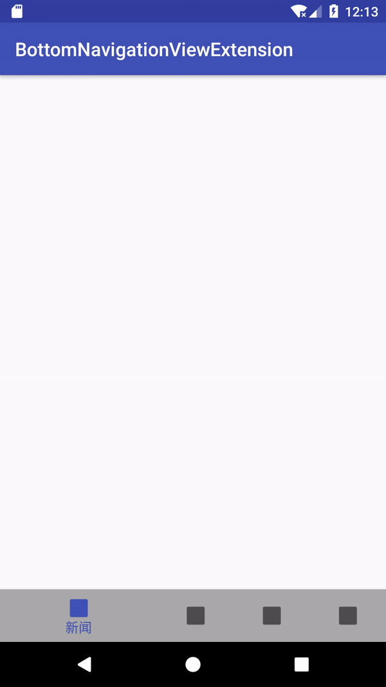
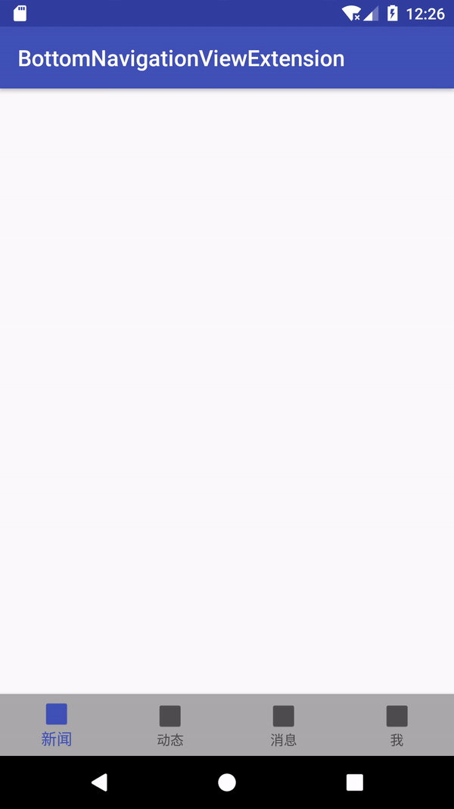
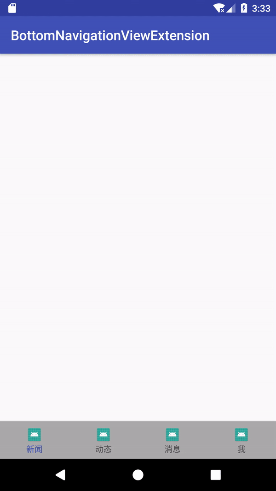

#  BottomNavigationView扩展

最近开展新的项目，首当其中的问题就是首页导航。

虽然之前就已经知道`BottomNavigationView`的存在，但是一直没有使用。原因也很明显，`BottomNavigationView`存在两个非常严重的问题：

1. 使用png格式的图标时无法显示原本的图案；
2. 默认有位移动画，且无法通过配置进行取消。



而这次不想再次进行一次自定义，决定采用官方的`BottomNavigationView`。那么就要解决上面提到的两个问题。

本着不重复造轮子的原则（主要是懒），先搜索了一下这两个问题的解决方案。

其中无法显示png图标的问题可以完美解决。但是去除位移动画的处理都不完美，并且全网的答案惊人一致。问题如下：

仅解决了位移动画的问题，但是并未解决图标及文本变大的问题。


没有时间看完下面改造过程的，直接复制这个文件添加到项目中即可：[BottomNavigationViewExtension](https://github.com/foolchen/BottomNavigationViewExtension/blob/master/bottom-nav-ext/src/main/java/com/foolchen/nav/ext/BottomNavExtension.kt)。


## 禁用位移动画

要禁用位移动画，首先要找到使位移动画生效的代码。我们定位到`BottomNavigationView`，分析代码后发现该View实际上是对`BottomNavigationMenuView`的包装：

```java
// ... 无关代码省略
private final BottomNavigationMenuView mMenuView;

public BottomNavigationView(Context context, AttributeSet attrs, int defStyleAttr) {
        super(context, attrs, defStyleAttr);
    
        // Create the menu
        mMenu = new BottomNavigationMenu(context);

        mMenuView = new BottomNavigationMenuView(context);
       
    	// 将一个BottomNavigationMenuView添加到了当前View中
        addView(mMenuView, params);
    }
```

则位移动画实际生效应该在`BottomNavigationMenuView`中，那么我们继续分析`BottomNavigationMenuView`的代码：

```java
public void buildMenuView() {
    // ...
    // 无关代码省略 
    mButtons = new BottomNavigationItemView[mMenu.size()];
    mShiftingMode = mMenu.size() > 3; // 当Menu中的item数量>3时，默认开启了位移动画
    for (int i = 0; i < mMenu.size(); i++) {
        // ...
        // 无关代码省略
        BottomNavigationItemView child = getNewItem();
        child.setShiftingMode(mShiftingMode);
        addView(child);
    }
}
```

我们发现，在菜单中条目的数量大于3时，开启了位移动画（mShiftingMode=true）。所以，如果要禁用位移动画的话，需要将`mShiftingMode`的值设置为false，并且重建菜单。

但是`mShiftingMode`的赋值是在重建菜单的时候进行的，在不修改源码的情况下此处无法做出修改。故继续分析`BottomNavigationItemView`。

```java
@Override
    public void setChecked(boolean checked) {
    	// ... 省略无关代码
        if (mShiftingMode) {
            // 当mShiftingMode=true时，该分支生效
            if (checked) {
                // ... 省略无关代码
                mLargeLabel.setVisibility(VISIBLE);
                mLargeLabel.setScaleX(1f);
                mLargeLabel.setScaleY(1f);
            } else {
                // ... 省略无关代码
                mLargeLabel.setVisibility(INVISIBLE);
                mLargeLabel.setScaleX(0.5f);
                mLargeLabel.setScaleY(0.5f);
            }
            mSmallLabel.setVisibility(INVISIBLE);
        } else {
            // 当mShiftingMode=false时，该分支生效
            if (checked) {
                LayoutParams iconParams = (LayoutParams) mIcon.getLayoutParams();
                iconParams.gravity = Gravity.CENTER_HORIZONTAL | Gravity.TOP;
                // 选中时，图标的顶部外边距增加了mDefaultMargin+mShiftAmount
                iconParams.topMargin = mDefaultMargin + mShiftAmount;
                mIcon.setLayoutParams(iconParams);
                
                mLargeLabel.setVisibility(VISIBLE);
                mSmallLabel.setVisibility(INVISIBLE);

                mLargeLabel.setScaleX(1f);
                mLargeLabel.setScaleY(1f);
                mSmallLabel.setScaleX(mScaleUpFactor);
                mSmallLabel.setScaleY(mScaleUpFactor);
            } else {
                LayoutParams iconParams = (LayoutParams) mIcon.getLayoutParams();
                iconParams.gravity = Gravity.CENTER_HORIZONTAL | Gravity.TOP;
                iconParams.topMargin = mDefaultMargin;
                mIcon.setLayoutParams(iconParams);
                
                mLargeLabel.setVisibility(INVISIBLE);
                mSmallLabel.setVisibility(VISIBLE);

                mLargeLabel.setScaleX(mScaleDownFactor);
                mLargeLabel.setScaleY(mScaleDownFactor);
                mSmallLabel.setScaleX(1f);
                mSmallLabel.setScaleY(1f);
            }
        }

        refreshDrawableState();
    }
```

从上述代码分析，要禁用位移动画，需要将`BottomNavigationItemView.mShiftingMode`的值设置为`false`。如果想要不修改源码，则此处需要使用反射。为了使用方便，定义一个`BottomNavigationView`的扩展方法：

```kotlin
fun BottomNavigationView.disableShiftMode() {
  try {
    val bottomNavigationMenuView = getChildAt(0) as BottomNavigationMenuView
    // BottomNavigationMenuView未提供setter方法来控制位移动画的开关，在不修改源码的前提下，只能通过反射来实现
    val shiftingMode = bottomNavigationMenuView.javaClass.getDeclaredField("mShiftingMode")
    shiftingMode.setBooleanValue(bottomNavigationMenuView, false)
    val childCount = bottomNavigationMenuView.childCount
    for (i in 0 until childCount) {
      val bottomNavigationItemView = bottomNavigationMenuView.getChildAt(
          i) as BottomNavigationItemView
      bottomNavigationItemView.setShiftingMode(false)
      // 重建菜单，该方法限制为进在com.android.support包中才能够调用,不知何时就会被隐藏掉.在被隐藏掉的时候可以尝试采用反射的方式进行调用
    bottomNavigationMenuView.updateMenuView()
  } catch (e: Exception) {
    e.printStackTrace()
  }
}
    
private fun Field.setBooleanValue(obj: Any, value: Boolean) {
  isAccessible = true
  setBoolean(obj, value)
  isAccessible = false
}
```

**注意：`BottomNavigationMenuView.updateMenuView()`和`BottomNavigationItemView.setShiftingMode()`被限制为仅能在`com.android.support`包中调用，如果在将来的support包中将这两个方法私有化，则可以尝试通过反射的方式来调用。**

修改完毕后效果如下：




## 统一所有条目中图标边距和文本的大小

在禁用了位移动画后，我们发现在选中一个条目的时候，条目的图标和文本框还是有轻微的位移。我们继续向下分析：

```java
@Override
    public void setChecked(boolean checked) {
    	// ... 省略无关代码
        if (mShiftingMode) {
            // 当mShiftingMode=true时，该分支生效
            if (checked) {
                // ... 省略无关代码
                mLargeLabel.setVisibility(VISIBLE);
                mLargeLabel.setScaleX(1f);
                mLargeLabel.setScaleY(1f);
            } else {
                // ... 省略无关代码
                mLargeLabel.setVisibility(INVISIBLE);
                mLargeLabel.setScaleX(0.5f);
                mLargeLabel.setScaleY(0.5f);
            }
            mSmallLabel.setVisibility(INVISIBLE);
        } else {
            // 当mShiftingMode=false时，该分支生效
            if (checked) {
                LayoutParams iconParams = (LayoutParams) mIcon.getLayoutParams();
                iconParams.gravity = Gravity.CENTER_HORIZONTAL | Gravity.TOP;
                // 选中时，图标的顶部外边距增加了mDefaultMargin+mShiftAmount
                iconParams.topMargin = mDefaultMargin + mShiftAmount;
                mIcon.setLayoutParams(iconParams);
                // 选中时，mLargeLabel显示、mSmallLabel隐藏
                mLargeLabel.setVisibility(VISIBLE);
                mSmallLabel.setVisibility(INVISIBLE);

                mLargeLabel.setScaleX(1f);
                mLargeLabel.setScaleY(1f);
                mSmallLabel.setScaleX(mScaleUpFactor);
                mSmallLabel.setScaleY(mScaleUpFactor);
            } else {
                LayoutParams iconParams = (LayoutParams) mIcon.getLayoutParams();
                iconParams.gravity = Gravity.CENTER_HORIZONTAL | Gravity.TOP;
                // 未选中时，图标的顶部外边距为默认值
                iconParams.topMargin = mDefaultMargin;
                mIcon.setLayoutParams(iconParams);
                
                // 未选中时，mLargeLabel隐藏、mSmallLabel显示
                mLargeLabel.setVisibility(INVISIBLE);
                mSmallLabel.setVisibility(VISIBLE);
				
                mLargeLabel.setScaleX(mScaleDownFactor);
                mLargeLabel.setScaleY(mScaleDownFactor);
                mSmallLabel.setScaleX(1f);
                mSmallLabel.setScaleY(1f);
            }
        }

        refreshDrawableState();
    }
```

从上面的代码中可以看出，问题原因在于选中的条目的图标增加了顶部外边距`mShiftAmount`，以及大小两个文本框的显隐变化。

为了解决这两个问题，做出如下扩展：

```kotlin
/**
 * 统一每个条目的文本大小和图标的外边距
 */
fun BottomNavigationView.unifyItems(forceUpdate: Boolean = true) {
  try {
    val bottomNavigationMenuView = getChildAt(0) as BottomNavigationMenuView
    val childCount = bottomNavigationMenuView.childCount
    for (i in 0 until childCount) {
      val child = bottomNavigationMenuView.getChildAt(i) as BottomNavigationItemView
      val clazz = child.javaClass

      // 使选中/未选中条目的顶部边距不发生变化
      val shiftAmountField = clazz.getDeclaredField("mShiftAmount")
      shiftAmountField.setIntValue(child, 0)

      // 使选中/未选中条目的文本保持同样的大小
      child.unifyTextSize()
    }

    if (forceUpdate) {
      bottomNavigationMenuView.updateMenuView()
    }
  } catch (e: Exception) {
    e.printStackTrace()
  }
}

private fun BottomNavigationItemView.unifyTextSize() {
  val baselineLayout = getChildAt(1) as BaselineLayout
  val smallLabel = baselineLayout.getChildAt(0) as TextView
  val largeLabel = baselineLayout.getChildAt(1) as TextView
  largeLabel.setTextSize(TypedValue.COMPLEX_UNIT_PX, smallLabel.textSize)
}

private fun Field.setIntValue(obj: Any, value: Int) {
  isAccessible = true
  setInt(obj, value)
  isAccessible = false
}
```

效果如下：


## 显示图标原本图案

```kotlin
/**
 * 禁用`app:itemIconTint`属性,让[BottomNavigationView]的图标显示原本的颜色
 */
fun BottomNavigationView.disableIconTint() {
  this.itemIconTintList = null
}
```

最终效果如下：



